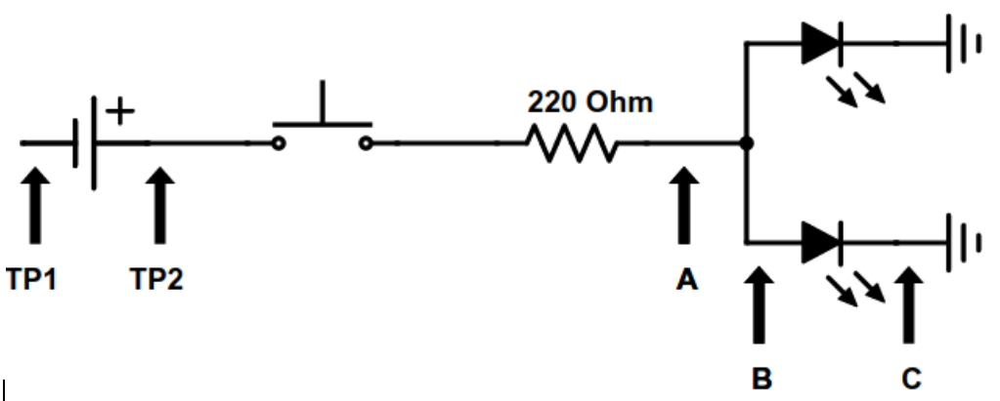
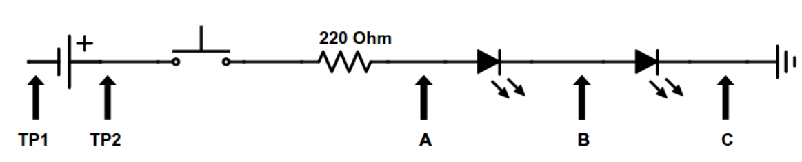

# Electronics Skills 2: Double LED
In this assignment you breadboard two LEDs in series and in parallel and explore how resistor values affect the flow of current. 

## Instructions
Make sure your breadboard is set up the following way before building the circuit.

## Circuit 2.1: Two LEDs in parallel
Build the following circuit of two LEDs in parallel. Show the circuit to your teacher for marking.  

In a parallel circuit current can travel along multiple paths. In this circuit the electric current is flowing through two loops, one for each LED. In other words, there are two paths for the electricity to take through the circuit.

## Circuit 2.2: Two LEDs in series
Build the following circuit of two LEDs in series. Show the circuit to your teacher for marking.   

In a serial circuit there is a single path for the electrical current. In this circuit the electric current is flowing through one LED at a time. In other words, there is a single paths for the electricity to take through the circuit.

# Circuit 2.3: Exploring the effect of different resistor values 
In this circuit you will use switches to explore what happens to the brightness of an LED with different values of resistors. Ask your teacher for the extra components for this circuit.

You can use this resistor color code calculator to figure out the value of a resistor: http://resistor.cherryjourney.pt/ 

Show the circuit to your teacher for marking.  

